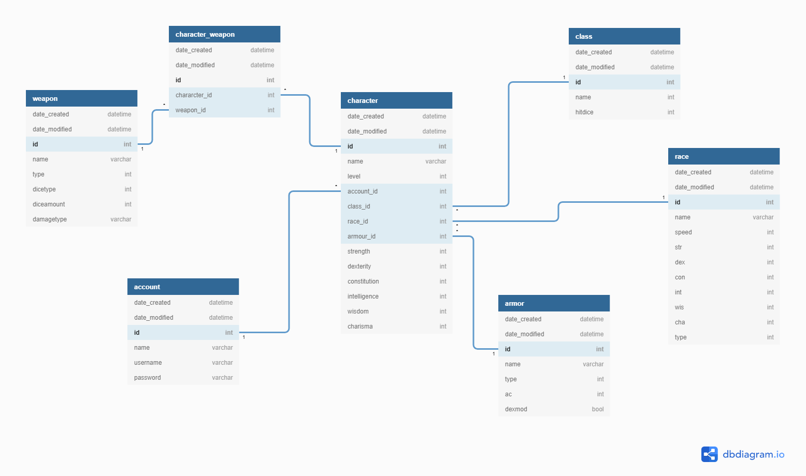

# DndCharacterSheet

[Demo Herokussa](https://dd-character-sheet.herokuapp.com/characters/)

[Käyttötapaukset](../master/documentation/userstories.md)

Dungeons & Dragons -roolipelissä (jatkossa D&D) käytetään hahmolomaketta, jossa määritellään hahmon rotu ja ammatti, jotka vaikuttavat hahmon ominaisuuksiin. Hahmolla on myös erilaisia esineitä esimerkiksi haarniskoita ja aseita, jotka omalta osaltaan vaikuttavat, kuinka vaikeaa hahmoon on osua ja kuinka kovaa hahmo lyö. Tarkoituksena tässä harjoitustyössä on tehdä käyttöliittymä D&D hahmon luomiseen ja hahmon ensinevaraston ylläpitoon. Lisäksi hahmolomake tekee hahmosta yhteenvedon laskemalla automaattisesti hahmon ominaisuudet ydistellen luokan, rodun ja käytössä olevien esineiden parametreja.

Toimintoja:
  * Hahmon luominen, muokkaaminen ja poistaminen
  * Hahmon tarkastelu
  * Esineen lisääminen hahmolle
  * Esineen poistaminen hahmolta
  
Relaatiokaavio

 
