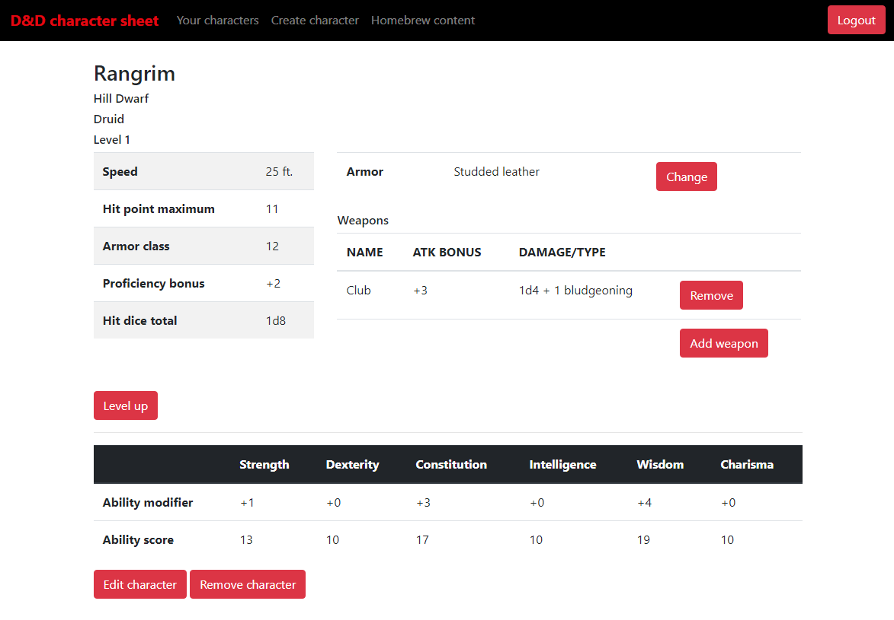

# Login and signup

1. Either from front page or from the upper corner, press the Login-button. You will be redirected to login form, where you can also press link to signup and create a new user.

2. In signup fill field for your name that you want to be called by the application. Then pick username and password and press "Add user".

3. If you don't remember your password, press link to change it. Fill in your username and pick a new password.

# Using the application
For now this application supports character generation via dice rolling. A popular method is to roll 4d6 and remove the smallest number. Then add the remaining dice. This way the minimum value for ability scores is 3 and maximum is 18.

In character creator pick your character a name, race and class. From race you will get some bonuses to your ability scores. From class you will get your hitdie. When creating character this will affect the maximum value of your hitpoints which comes from hitdie + your conmodifier (these are calculated automatically by the application).

After character creation you can view the character. The application will make a summary of your character including hit point, ability modifiers, armor class etc. Here you can also change the armor your character is wearing and add weapons for your character to wield.

With the application you can also homebrew weapons for your characters to use. Pick a name, weapon type, damagedie, dice amount, damagetype and other attributes for the weapon. You can decided if you want other users to see and use your creations by making it public. 
